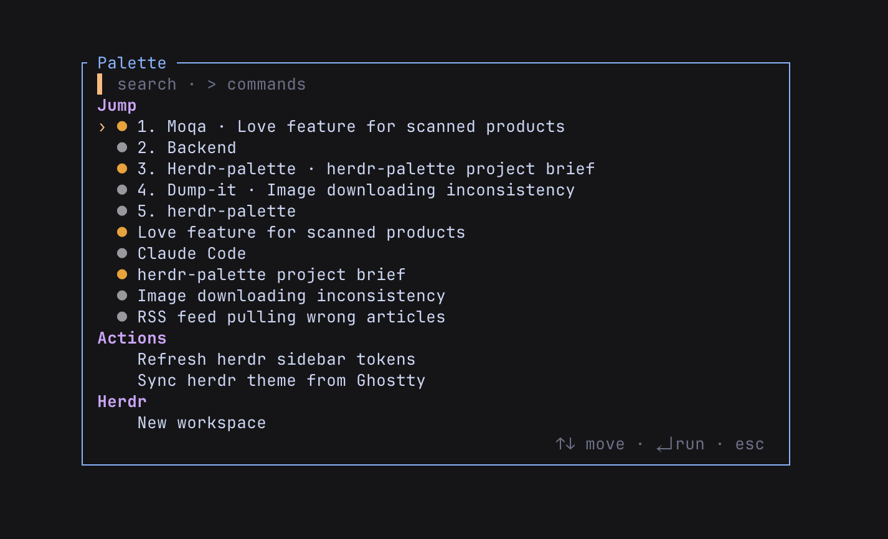

# herdr-palette

A command palette for [Herdr](https://herdr.dev). It opens in a centered
popup pane. Type to filter. Press Enter to run. 🐑




The palette shows three groups:

1. **Jump** — Herdr workspaces and agents, with live status dots.
   Enter focuses the selection. When an agent waits for input, the
   group starts with a "Next blocked agent" entry.
2. **Actions** — actions from all installed Herdr plugins.
   Enter invokes the action.
3. **Herdr** — built-in commands: new workspace, new tab, rename
   workspace, rename tab, reload config, phone mode.

## Requirements

- Herdr 0.8.0 or later.

The install step downloads one prebuilt static binary from GitHub
Releases and verifies its checksum. No toolchain is needed. Prebuilt
platforms: macOS and Linux, arm64 and amd64.

## Install

```sh
herdr plugin install Binb1/herdr-palette
```

Then add a keybinding to `~/.config/herdr/config.toml`:

```toml
[[keys.command]]
key = "prefix+f"
type = "plugin_action"
command = "binb1.palette.open"
description = "Command palette"
```

Reload the config:

```sh
herdr server reload-config
```

Press `prefix+f` inside a Herdr session to toggle the palette. The
action opens the palette when it is closed. It closes the palette when
it is open.

Optional: bind `Cmd+P` directly. This needs a terminal that forwards
the cmd key, such as Ghostty:

```toml
[[keys.command]]
key = "cmd+p"
type = "plugin_action"
command = "binb1.palette.open"
description = "Command palette"
```

## Keys

| Key | Effect |
|---|---|
| type | Filter the list (fuzzy match) |
| `>` | Filter commands only (Actions and Herdr groups) |
| `↑` `↓` | Move the selection |
| `Enter` | Run the selected entry |
| `Esc` | Close the palette |

The mouse also works. Click an entry to run it. Scroll to move the
selection.

## Status dots

Each Jump entry shows the agent status as a colored dot:

- 🟠 `working` — the agent runs a task
- 🔴 `blocked` — the agent waits for input
- 🟢 `done` — the agent finished
- ⚪ `idle` — no active task

(The palette renders small colored dots, not emoji.)

## Phone mode

"Phone mode" flattens the layout for a narrow client, such as a phone
attached over SSH or mosh. Every pane in a split tab moves to its own
tab, so each pane gets the full width. "Exit phone mode" moves every
pane back and restores the splits.

Phone mode is also automatic. When a client makes the layout narrower
than 60 columns, the plugin engages phone mode. When the layout is
wide again, the plugin restores the splits. The automatic exit only
undoes an automatic entry: a manual "Phone mode" stays until a manual
"Exit phone mode".

The automatic exit needs the layout to grow wide again. A mosh client
stays attached when the phone app is backgrounded, so the layout stays
narrow until the phone session ends. Herdr also sizes a shared session
to its smallest client, so a phone and a desktop attached together
both see the phone width. To restore the splits on the desktop while
the phone is still attached, run "Exit phone mode" (or the toggle
action). A manual exit is remembered, so the automatic hook does not
re-engage until the layout goes wide again.

The `binb1.palette.phone` action toggles phone mode. Bind it to a key,
or invoke it with `herdr plugin action invoke binb1.palette.phone`.

Notes:

- Two-pane splits restore exactly. Deeper nested splits restore with
  the right panes in the right tabs, but the geometry can differ.
- A pane closed during phone mode is skipped on restore.
- The state lives in one JSON file in the plugin state directory. The
  palette shows "Exit phone mode" while that file exists.

## Development

A local checkout needs Go 1.21 or later:

```sh
go build -o bin/herdr-palette .
herdr plugin link .
herdr plugin action invoke binb1.palette.open
```

`herdr plugin log list --plugin binb1.palette` shows process logs.
`vhs demo.tape` re-records the README GIF.

Releases: bump `version` in `herdr-plugin.toml`, merge, then push the
matching tag (`vX.Y.Z`). GitHub Actions runs goreleaser and publishes
the binaries the install step downloads.

## Limits

Herdr 0.8.2 does not expose detach or sidebar commands over its socket
API. The Herdr group omits them.

## License

MIT
