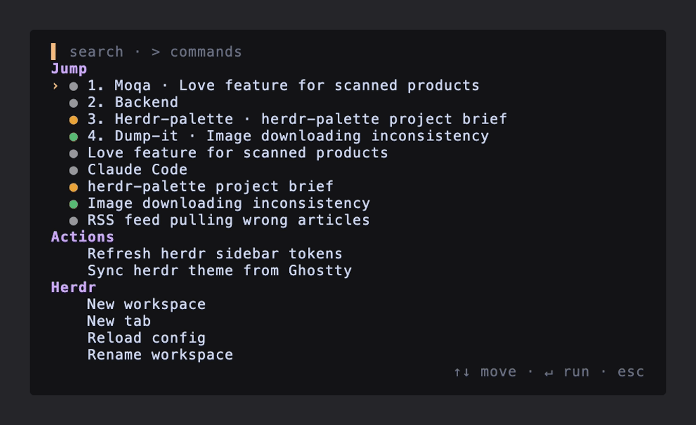

# herdr-palette

A command palette for [Herdr](https://herdr.dev). It opens in a centered
popup pane. Type to filter. Press Enter to run. 🐑



The palette shows three groups:

1. **Jump** — Herdr workspaces and agents, with live status dots.
   Enter focuses the selection. When an agent waits for input, the
   group starts with a "Next blocked agent" entry.
2. **Actions** — actions from all installed Herdr plugins.
   Enter invokes the action.
3. **Herdr** — built-in commands: new workspace, new tab, rename
   workspace, rename tab, reload config.

## Requirements

- Herdr 0.8.0 or later.

The install step downloads one prebuilt static binary from GitHub
Releases and verifies its checksum. No toolchain is needed. Prebuilt
platforms: macOS and Linux, arm64 and amd64.

## Install

```sh
herdr plugin install Binb1/herdr-palette
```

Then add a keybinding to `~/.config/herdr/config.toml`:

```toml
[[keys.command]]
key = "prefix+f"
type = "plugin_action"
command = "binb1.palette.open"
description = "Command palette"
```

Reload the config:

```sh
herdr server reload-config
```

Press `prefix+f` inside a Herdr session to toggle the palette. The
action opens the palette when it is closed. It closes the palette when
it is open.

Optional: bind `Cmd+P` directly. This needs a terminal that forwards
the cmd key, such as Ghostty:

```toml
[[keys.command]]
key = "cmd+p"
type = "plugin_action"
command = "binb1.palette.open"
description = "Command palette"
```

## Keys

| Key | Effect |
|---|---|
| type | Filter the list (fuzzy match) |
| `>` | Filter commands only (Actions and Herdr groups) |
| `↑` `↓` | Move the selection |
| `Enter` | Run the selected entry |
| `Esc` | Close the palette |

The mouse also works. Click an entry to run it. Scroll to move the
selection.

## Status dots

Each Jump entry shows the agent status as a colored dot:

- 🟠 `working` — the agent runs a task
- 🔴 `blocked` — the agent waits for input
- 🟢 `done` — the agent finished
- ⚪ `idle` — no active task

(The palette renders small colored dots, not emoji.)

## Development

A local checkout needs Go 1.21 or later:

```sh
go build -o bin/herdr-palette .
herdr plugin link .
herdr plugin action invoke binb1.palette.open
```

`herdr plugin log list --plugin binb1.palette` shows process logs.
`vhs demo.tape` re-records the README GIF.

Releases: bump `version` in `herdr-plugin.toml`, merge, then push the
matching tag (`vX.Y.Z`). GitHub Actions runs goreleaser and publishes
the binaries the install step downloads.

## Limits

Herdr 0.8.2 does not expose detach or sidebar commands over its socket
API. The Herdr group omits them.

## License

MIT
